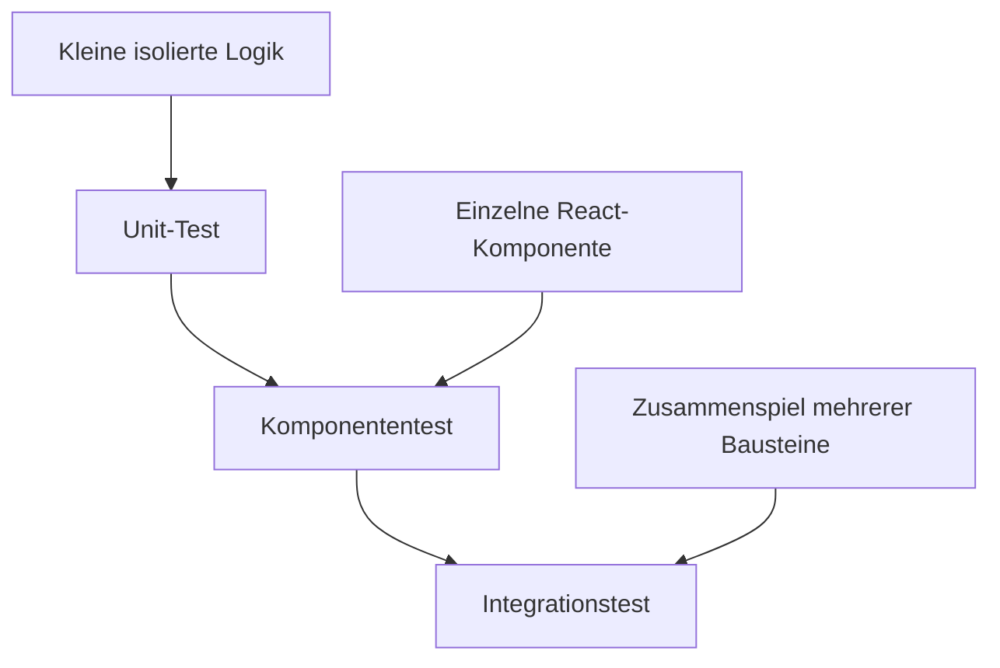
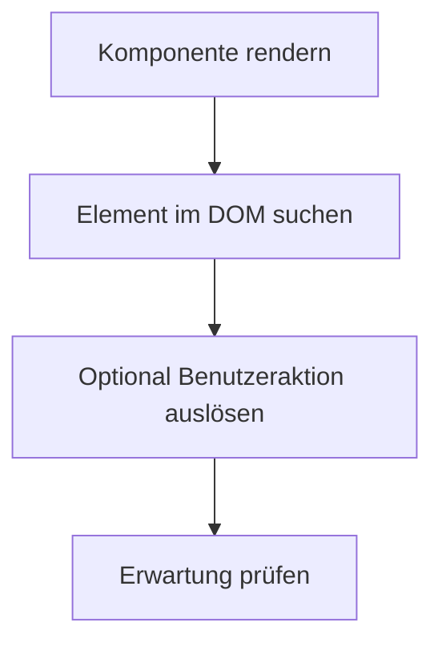
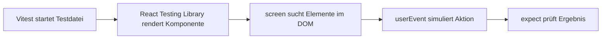

###### Themen

Grundlagen des Testings in React

- Unterschied zwischen Unit-, Integrations- und Komponententests
- Ziel und Nutzen von Tests in React-Anwendungen
- Aufbau einer Testdatei und einfache Teststruktur

Testing Tools

- Einführung in Vitest für React-Projekte
- Einführung in React Testing Library
- Erster Test einer einfachen React-Komponente

# 🧪 Grundlagen des Testens in React

Tests sind in React nicht einfach nur ein „Extra“, sondern ein Werkzeug, mit dem du überprüfen kannst, ob deine Benutzeroberfläche so funktioniert, wie du es erwartest. Gerade in React 19 ist das wichtig, weil Anwendungen oft aus vielen kleinen Komponenten bestehen, die sich gegenseitig beeinflussen. Sobald sich Props, State, Effekte, Events oder asynchrone Datenflüsse ändern, können Fehler entstehen, die man mit bloßem Klicken leicht übersieht.

Beim Testen in React geht es deshalb nicht nur darum, ob „der Code läuft“, sondern ob sich die Anwendung aus Sicht des Nutzers korrekt verhält. Die offizielle React-Dokumentation empfiehlt heute ausdrücklich testnahe Ansätze, die sich am echten Verhalten der Anwendung orientieren, statt nur interne Implementierungsdetails zu prüfen ([React – Testing Overview](https://react.dev/learn/testing)).


<br><br><br>
## 🔍 Unterschied zwischen Unit-, Integrations- und Komponententests

Diese drei Testarten werden oft zusammen genannt, aber sie prüfen unterschiedliche Dinge. Der wichtigste Unterschied liegt darin, **wie viel vom System gleichzeitig getestet wird**.

### 🧩 Unit-Tests

Ein Unit-Test prüft eine **kleine, isolierte Einheit** deines Programms. Das ist oft eine Funktion, manchmal auch ein Hook oder eine sehr klar abgegrenzte Logik.

Wenn du zum Beispiel eine Hilfsfunktion hast, die einen Preis mit Rabatt berechnet, dann ist das ein typischer Fall für einen Unit-Test. Du gibst Eingaben hinein und prüfst, ob die erwartete Ausgabe zurückkommt. Dabei interessiert dich nicht das DOM, nicht React selbst und auch nicht das Zusammenspiel mit anderen Komponenten.

Unit-Tests sind schnell, präzise und gut geeignet, um reine Logik abzusichern. Sie helfen dir besonders dann, wenn deine Anwendung viele Berechnungen, Validierungen oder kleine Hilfsfunktionen enthält.

Ein einfacher gedanklicher Merksatz ist:

> Unit-Test = „Funktioniert diese kleinste Einheit für sich allein?“


<br><br><br>
### 🧱 Komponententests

Ein Komponententest prüft eine **einzelne React-Komponente**. Dabei interessiert dich vor allem, was gerendert wird und wie sich die Komponente bei Benutzerinteraktionen verhält.

Du testest zum Beispiel:

- Wird ein Titel angezeigt?
- Erscheint ein Button?
- Ändert sich der Text nach einem Klick?
- Wird eine Fehlermeldung sichtbar, wenn eine Bedingung erfüllt ist?

Im React-Umfeld sind Komponententests oft der wichtigste Testtyp, weil React-Anwendungen genau aus solchen UI-Bausteinen bestehen. Mit Tools wie der React Testing Library testest du Komponenten so, wie ein Nutzer sie erleben würde: über sichtbaren Text, Rollen, Labels und Interaktionen ([React Testing Library – Introduction](https://testing-library.com/docs/react-testing-library/intro/)).

Ein Komponententest ist also stärker an der Oberfläche der Anwendung orientiert als ein Unit-Test.

Merksatz:

> Komponententest = „Verhält sich diese React-Komponente im Browser so, wie sie soll?“


<br><br><br>
### 🔗 Integrationstests

Ein Integrationstest prüft das **Zusammenspiel mehrerer Teile** einer Anwendung. Hier wird nicht nur eine isolierte Funktion oder eine einzelne Komponente betrachtet, sondern mehrere Einheiten gemeinsam.

Typische Beispiele:

- Eine Formular-Komponente arbeitet mit Validierung und einem Submit-Handler zusammen.
- Eine Seite lädt Daten und zeigt danach eine Liste an.
- Ein Klick in einer Elternkomponente verändert etwas in einer Kindkomponente.
- Routing, Context, API-Mocks und UI greifen ineinander.

Bei Integrationstests ist wichtig, dass du nicht zu viel mockst. Denn das Ziel ist gerade zu prüfen, ob die beteiligten Teile korrekt miteinander arbeiten. Die React Testing Library fördert genau diese Denkweise: nicht intern testen, sondern das Verhalten, das durch mehrere Bestandteile gemeinsam entsteht ([Guiding Principles – Testing Library](https://testing-library.com/docs/guiding-principles/)).

Merksatz:

> Integrationstest = „Arbeiten diese Teile zusammen korrekt?“


<br><br><br>
### 📊 Vergleich der Testarten

| Testart | Was wird geprüft? | Typisches Beispiel in React | Vorteil |
|---|---|---|---|
| Unit-Test | Kleine isolierte Logik | Hilfsfunktion, Formatter, Validator, Custom-Hook-Logik | Sehr schnell, sehr gezielt |
| Komponententest | Eine React-Komponente | Button, Formularfeld, Modal, Counter | Testet sichtbares UI-Verhalten |
| Integrationstest | Zusammenspiel mehrerer Teile | Formular + Validierung + Submit + API-Mock | Erkennt echte Ablaufprobleme |

Wichtig ist: Diese Kategorien sind in der Praxis nicht immer messerscharf getrennt. Ein Komponententest kann schon integrationsnah sein, wenn die Komponente z. B. Context, Routing oder Datenzustände verwendet. Das ist völlig normal. Entscheidend ist nicht der Name des Tests, sondern **welches Verhalten du absichern willst**.


<br><br><br>
### 🗺️ Wie sich die Testarten zueinander verhalten



Je weiter du in Richtung Integration gehst, desto näher bist du an der echten Nutzung deiner Anwendung. Gleichzeitig werden Tests oft etwas umfangreicher und langsamer. Deshalb braucht eine gute Teststrategie meist eine Mischung aus allen drei Arten.


<br><br><br>
## 🎯 Ziel und Nutzen von Tests in React-Anwendungen

Tests haben mehrere Aufgaben gleichzeitig. Viele denken zuerst an „Fehler finden“, aber der eigentliche Nutzen ist breiter.

### 🛡️ Fehler früh erkennen

Wenn du Änderungen an einer Komponente vornimmst, kann etwas kaputtgehen, das vorher funktioniert hat. Tests zeigen dir solche Probleme frühzeitig. Das ist besonders wertvoll in React, weil kleine Änderungen an Props, State oder Rendering-Logik unerwartete Seiteneffekte haben können.

Ein Beispiel: Du änderst die Struktur eines Buttons, damit er schöner aussieht. Plötzlich fehlt der zugängliche Name oder der Klick löst nichts mehr aus. Ein guter Test erkennt das sofort.


<br><br><br>
### 🔁 Refactoring sicherer machen

React-Code wird ständig umgebaut: Komponenten werden aufgeteilt, Logik wird in Hooks verschoben, Props werden umbenannt, Zustände werden neu organisiert. Tests geben dir dabei Sicherheit.

Wenn ein Test nicht auf interne Details, sondern auf das sichtbare Verhalten prüft, kannst du den internen Code relativ frei verbessern, solange die Komponente sich für Nutzer gleich verhält. Genau das ist einer der größten praktischen Vorteile von Tests.


<br><br><br>
### 👀 Verhalten aus Nutzersicht absichern

Moderne React-Tests sollen sich möglichst an der echten Bedienung orientieren. Statt zu prüfen, ob irgendeine interne Methode aufgerufen wurde, ist oft sinnvoller zu prüfen:

- Sieht der Nutzer den richtigen Text?
- Kann er auf den Button klicken?
- Erscheint nach dem Klick das erwartete Ergebnis?
- Wird ein Formularfehler angezeigt?

Die Testing Library beschreibt genau dieses Prinzip: Teste so, wie Software tatsächlich benutzt wird ([Guiding Principles – Testing Library](https://testing-library.com/docs/guiding-principles/)).

Das ist wichtig, weil ein Test sonst zwar „grün“ sein kann, die Anwendung aber trotzdem für den Nutzer kaputt ist.


<br><br><br>
### 📚 Tests als lebendige Dokumentation

Gut geschriebene Tests erklären, wie eine Komponente gedacht ist. Wenn jemand neu in ein Projekt kommt, kann er oft aus den Tests schneller verstehen:

- Welche Eingaben erwartet eine Komponente?
- Was passiert bei einem Klick?
- Welche Zustände gibt es?
- Was ist der gewünschte Standardfall?

Damit werden Tests zu einer Form von Dokumentation, die im Idealfall näher an der Realität ist als ein geschriebenes Wiki, weil sie tatsächlich ausgeführt wird.


<br><br><br>
### 🚀 Mehr Stabilität in Teams und bei Releases

In größeren React-Anwendungen arbeiten oft mehrere Entwickler gleichzeitig an denselben Komponenten oder Seiten. Tests helfen dabei, unbeabsichtigte Auswirkungen von Änderungen sichtbar zu machen.

Besonders bei Continuous Integration, also automatischen Prüfungen beim Push oder Pull Request, sind Tests ein Sicherheitsnetz. Sie verhindern nicht jeden Fehler, aber sie senken das Risiko deutlich.


<br><br><br>
### ⚠️ Was Tests nicht leisten

Tests sind sehr nützlich, aber sie ersetzen nicht alles.

Sie garantieren nicht automatisch:

- gutes Architekturdesign,
- fehlerfreie Fachlogik,
- perfekte Benutzerfreundlichkeit,
- vollständige visuelle Korrektheit.

Ein Test kann auch schlecht geschrieben sein. Zum Beispiel, wenn er zu sehr an interne Details gekoppelt ist oder kaum echten Nutzen prüft. Gute React-Tests konzentrieren sich deshalb auf **beobachtbares Verhalten** statt auf Implementierungsdetails.


<br><br><br>
## 🧾 Aufbau einer Testdatei und einfache Teststruktur

In React-Projekten mit Vitest und React Testing Library sehen Testdateien meist sehr ähnlich aus. Diese Wiedererkennbarkeit ist hilfreich, weil man Tests dann schnell lesen und schreiben kann.

### 🗂️ Typische Dateinamen

Häufige Namen sind:

- `Button.test.tsx`
- `Counter.test.jsx`
- `LoginForm.spec.tsx`

Vitest erkennt Testdateien typischerweise an Endungen wie `.test.` oder `.spec.`, je nach Konfiguration. Das ist Teil des üblichen Test-Setups in Vitest ([Vitest – Getting Started](https://vitest.dev/guide/)).

Der Test liegt meist:

- direkt neben der Komponente, oder
- in einem separaten `tests`-Ordner.

Beides ist möglich. In React-Projekten ist das Platzieren neben der Komponente oft praktisch, weil Test und Implementierung nah beieinander liegen.


<br><br><br>
### 🧱 Grundbausteine einer Testdatei

Eine einfache Testdatei besteht meistens aus diesen Teilen:

1. **Imports**
2. **Beschreibung der Testgruppe mit `describe()`**
3. **Einzelne Tests mit `test()` oder `it()`**
4. **Rendering der Komponente**
5. **Abfragen des DOM**
6. **Erwartungen mit `expect()`**

Hier ist eine sehr einfache Struktur:

```tsx
import { render, screen } from '@testing-library/react'
import { describe, test, expect } from 'vitest'
import { Hello } from './Hello'

describe('Hello-Komponente', () => {
  test('zeigt den übergebenen Namen an', () => {
    render(<Hello name="Ada" />)

    expect(screen.getByText('Hallo Ada')).toBeInTheDocument()
  })
})
```

So eine Datei ist klein, aber sie enthält schon das Wesentliche:

- `render(...)` rendert die React-Komponente in eine Test-Umgebung.
- `screen.getByText(...)` sucht nach sichtbarem Inhalt.
- `expect(...)` formuliert die Erwartung.

Die DOM-Matcher wie `toBeInTheDocument()` werden in der Regel über `@testing-library/jest-dom` bereitgestellt, das auch mit Vitest verwendet werden kann ([jest-dom – Testing Library](https://github.com/testing-library/jest-dom)).


<br><br><br>
### 🔍 Bedeutung der wichtigsten Teile

#### `describe()`

`describe()` gruppiert zusammengehörige Tests. Das ist nützlich, damit deine Testausgabe übersichtlich bleibt. Du kannst zum Beispiel alle Tests einer Komponente in einen gemeinsamen Block setzen.

```tsx
describe('Button', () => {
  // Tests für den Button
})
```

#### `test()` oder `it()`

Beide machen praktisch dasselbe. Sie definieren einen einzelnen Testfall.

```tsx
test('rendert den Button-Text', () => {
  // ...
})
```

oder

```tsx
it('rendert den Button-Text', () => {
  // ...
})
```

Viele Teams wählen eine Variante und bleiben konsistent dabei.

#### `render()`

Mit `render()` aus der React Testing Library wird deine Komponente in eine simulierte DOM-Umgebung gerendert. So kannst du sie ähnlich prüfen, wie sie im Browser erscheinen würde ([React Testing Library – API](https://testing-library.com/docs/react-testing-library/api/)).

#### `screen`

`screen` stellt Suchfunktionen bereit, um Elemente im gerenderten DOM zu finden. Besonders häufig sind:

- `getByRole(...)`
- `getByText(...)`
- `getByLabelText(...)`

Die Testing Library empfiehlt bevorzugt Abfragen, die nah an der echten Nutzung sind, etwa über Rollen und Labels ([About Queries – Testing Library](https://testing-library.com/docs/queries/about/)).

#### `expect()`

Mit `expect()` formulierst du, was du erwartest. Zum Beispiel:

- dass ein Element vorhanden ist,
- dass Text sichtbar ist,
- dass ein Button deaktiviert ist,
- dass etwas nach einem Klick erscheint.


<br><br><br>
### 🧠 Warum `getByRole()` oft besser ist als `getByText()`

Gerade in React-Tests ist `getByRole()` sehr wichtig, weil es semantisch und nutzernah prüft. Ein Button wird nicht nur als Text erkannt, sondern als Bedienelement mit einer Rolle.

Beispiel:

```tsx
screen.getByRole('button', { name: /speichern/i })
```

Dieser Test prüft, ob ein Button mit dem Namen „Speichern“ vorhanden ist. Das ist meist robuster als nur nach Text zu suchen, weil es gleichzeitig die Zugänglichkeit der Komponente mitberührt ([About Queries – Testing Library](https://testing-library.com/docs/queries/about/)).

Für React 19 ist das besonders passend, weil moderne React-Anwendungen sehr stark auf gute, zugängliche UI-Komponenten setzen sollten.


<br><br><br>
### 🪜 Typischer Ablauf eines einfachen Komponententests



Dieser Ablauf ist die Grundlage fast aller UI-Tests in React.


<br><br><br>
# 🛠️ Testing-Tools

In modernen React-Projekten werden besonders häufig zwei Werkzeuge kombiniert:

- **Vitest** als Test-Runner
- **React Testing Library** zum Rendern und Testen von React-Komponenten

Diese Kombination ist heute sehr beliebt, weil sie schnell, modern und gut mit Vite-basierten Projekten funktioniert. Vitest ist eng auf das Vite-Ökosystem abgestimmt ([Vitest – Why Vitest](https://vitest.dev/guide/why.html)), und die React Testing Library ist auf benutzernahe UI-Tests ausgerichtet ([React Testing Library – Introduction](https://testing-library.com/docs/react-testing-library/intro/)).


<br><br><br>
## ⚡ Einführung in Vitest für React-Projekte

Vitest ist ein moderner Test-Runner für JavaScript- und TypeScript-Projekte. In React-Projekten übernimmt Vitest vor allem diese Aufgaben:

- Testdateien finden
- Tests ausführen
- Ergebnisse anzeigen
- Assertions ermöglichen
- Mocks, Spies und Setup-Dateien unterstützen

Man kann sich Vitest als das Werkzeug vorstellen, das den gesamten Testprozess organisiert.

### 🧰 Warum Vitest in React-Projekten so beliebt ist

Vitest ist besonders attraktiv, wenn dein React-Projekt mit Vite arbeitet. Dann profitiert Vitest von der schnellen Infrastruktur und dem Modul-System von Vite. Das führt oft zu sehr schnellen Testläufen, besonders im Entwicklungsalltag ([Vitest – Why Vitest](https://vitest.dev/guide/why.html)).

Weitere typische Vorteile:

- schnelle Ausführung
- gute TypeScript-Unterstützung
- moderne ESM-Unterstützung
- API, die vielen Entwicklern von Jest vertraut vorkommt

Wenn du schon einmal mit Jest gearbeitet hast, wirst du in Vitest vieles wiedererkennen: `describe`, `test`, `expect`, `beforeEach`, `vi.fn()` und so weiter.


<br><br><br>
### 🏗️ Welche Rolle Vitest im Test-Stack spielt

Vitest testet nicht „von selbst“ React-Komponenten auf Benutzerebene. Dafür braucht es ergänzend die React Testing Library. Die Aufgabenverteilung ist also ungefähr so:

| Werkzeug | Hauptaufgabe |
|---|---|
| Vitest | Tests ausführen, Struktur bereitstellen, Assertions und Mocks ermöglichen |
| React Testing Library | React-Komponenten rendern und das UI-Verhalten prüfen |
| jest-dom | Zusätzliche DOM-Matcher wie `toBeInTheDocument()` bereitstellen |

So greifen die Werkzeuge ineinander.


<br><br><br>
### ⚙️ Typisches Grund-Setup mit Vitest

Ein typisches React-Projekt mit Vitest enthält in der Regel:

- das Paket `vitest`
- das Paket `jsdom`, damit Browser-ähnliches DOM-Verhalten in Tests verfügbar ist
- eine Konfiguration, die das Test-Environment auf `jsdom` setzt
- eine Setup-Datei für `jest-dom`

Ein Beispiel für die Konfiguration:

```ts
// vitest.config.ts
import { defineConfig } from 'vitest/config'
import react from '@vitejs/plugin-react'

export default defineConfig({
  plugins: [react()],
  test: {
    environment: 'jsdom',
    setupFiles: './src/test/setup.ts',
  },
})
```

Warum `jsdom`? React-Komponenten rendern HTML-artige Strukturen und reagieren auf DOM-Interaktionen. In Node.js gibt es standardmäßig kein echtes Browser-DOM. `jsdom` simuliert dieses Verhalten, sodass UI-Tests möglich werden ([Vitest – Environment](https://vitest.dev/guide/environment.html)).

Die Setup-Datei könnte so aussehen:

```ts
// src/test/setup.ts
import '@testing-library/jest-dom/vitest'
```

Damit stehen Matcher wie `toBeInTheDocument()` in Vitest zur Verfügung ([jest-dom – With Vitest](https://github.com/testing-library/jest-dom#with-vitest)).


<br><br><br>
### 🧪 Wichtige Vitest-Funktionen

#### `describe`, `test`, `expect`

Das sind die Grundbausteine für deine Teststruktur.

```ts
describe('Gruppe', () => {
  test('einzelner Test', () => {
    expect(2 + 2).toBe(4)
  })
})
```

#### `beforeEach` und `afterEach`

Damit kannst du Code vor oder nach jedem Test ausführen. Das ist nützlich, wenn du Testdaten vorbereiten oder zurücksetzen musst.

#### `vi`

`vi` ist das Mocking- und Spy-Werkzeug in Vitest. Damit kannst du Funktionen simulieren oder überwachen.

Beispiel:

```ts
import { vi } from 'vitest'

const onClick = vi.fn()
```

Das ist besonders hilfreich, wenn du prüfen willst, ob ein Event-Handler aufgerufen wurde.


<br><br><br>
### 👀 Watch Mode und Entwickleralltag

Vitest kann Tests im Watch Mode laufen lassen. Das bedeutet: Wenn du Dateien änderst, werden passende Tests automatisch erneut ausgeführt. Gerade in React-Komponenten ist das sehr angenehm, weil du schnell Rückmeldung bekommst, ob dein UI-Verhalten noch stimmt ([Vitest – CLI](https://vitest.dev/guide/cli.html)).

So wird Testen weniger ein „großer Extra-Schritt“ und mehr ein Teil des normalen Entwicklungsflusses.


<br><br><br>
## 🧪 Einführung in React Testing Library

Die React Testing Library ist ein Werkzeug zum Testen von React-Komponenten. Sie hilft dir, Komponenten zu rendern, im DOM nach Elementen zu suchen und Benutzerinteraktionen zu simulieren.

Die zentrale Idee lautet: **Teste das Verhalten so, wie Nutzer die Oberfläche erleben.** Genau das ist das Leitprinzip der Library ([Guiding Principles – Testing Library](https://testing-library.com/docs/guiding-principles/)).

### 🧠 Das Grundprinzip

Statt interne Zustände oder Implementierungsdetails zu testen, konzentrierst du dich auf sichtbare Effekte:

- Was wird gerendert?
- Was sieht der Nutzer?
- Welche Eingaben kann er machen?
- Was passiert nach einem Klick?

Das ist für React besonders sinnvoll, weil sich Implementierungen intern häufig ändern, während das gewünschte sichtbare Verhalten gleich bleiben soll.


<br><br><br>
### 🧱 Zentrale Werkzeuge der React Testing Library

#### `render()`

`render()` rendert eine Komponente in die Testumgebung.

```tsx
render(<Button>Speichern</Button>)
```

Danach kannst du im DOM nach dem Button suchen.

#### `screen`

`screen` stellt globale Abfragefunktionen bereit. Das macht Tests lesbarer, weil du nicht mit den Rückgabewerten von `render()` hantieren musst.

Beispiel:

```tsx
screen.getByRole('button', { name: /speichern/i })
```

#### Query-Arten

Die wichtigsten Query-Typen sind:

| Query | Bedeutung |
|---|---|
| `getBy...` | Erwartet, dass das Element vorhanden ist, sonst Fehler |
| `queryBy...` | Sucht optional, gibt `null` zurück, wenn nichts gefunden wird |
| `findBy...` | Für asynchrone Fälle, wartet auf das Element |

Das ist wichtig für React, weil UI-Zustände oft asynchron entstehen, zum Beispiel nach Datenladen, Effekten oder Benutzeraktionen ([About Queries – Testing Library](https://testing-library.com/docs/queries/about/)).


<br><br><br>
### 🖱️ Benutzerinteraktionen testen

Für Interaktionen wird heute meist `userEvent` verwendet. Damit kannst du realistischere Aktionen simulieren als mit sehr niedrigen DOM-Events. Dazu gehören:

- klicken
- tippen
- Texteingaben
- Tab-Navigation

Die Testing Library empfiehlt `@testing-library/user-event` für nutzernahe Interaktionen ([user-event – Introduction](https://testing-library.com/docs/user-event/intro/)).

Beispiel:

```tsx
import userEvent from '@testing-library/user-event'

const user = userEvent.setup()
await user.click(screen.getByRole('button', { name: /öffnen/i }))
```

Das ist oft näher an echtem Benutzerverhalten als manuelles Auslösen primitiver Events.


<br><br><br>
### ♿ Warum die React Testing Library gut zur Barrierefreiheit passt

Viele Abfragen orientieren sich an semantischen HTML-Rollen, Labels und sichtbaren Namen. Wenn du also mit `getByRole()` oder `getByLabelText()` testest, schreibst du häufig automatisch Tests, die gute zugängliche Strukturen fördern.

Beispiel:

```tsx
screen.getByLabelText(/e-mail/i)
```

Wenn dieser Test nicht funktioniert, kann das ein Hinweis darauf sein, dass dein Formularfeld nicht korrekt beschriftet ist. Tests helfen hier also indirekt auch bei der Qualität deiner UI-Struktur.


<br><br><br>
### 🚫 Was man mit der React Testing Library eher vermeiden sollte

Weniger sinnvoll ist es, stark auf interne Details zu testen, etwa:

- interne State-Namen,
- konkrete Implementierungsfunktionen,
- CSS-Klassen als Hauptbeweis für Verhalten,
- private Strukturdetails ohne Nutzerrelevanz.

Denn solche Tests brechen leicht bei Refactorings, obwohl die Anwendung für Nutzer unverändert korrekt funktioniert.

Gerade in React 19 ist dieser Punkt wichtig: Moderne React-Entwicklung setzt stark auf klare Komponenten, gute Zugänglichkeit und verhaltensorientiertes Testen. Das passt sehr gut zur Philosophie der Testing Library ([React – Testing Overview](https://react.dev/learn/testing)).


<br><br><br>
## 🧱 Erster Test einer einfachen React-Komponente

Jetzt kommt der praktische Teil: ein erster kleiner Test einer React-Komponente mit Vitest und React Testing Library.

### 🧩 Beispielkomponente

Nehmen wir eine sehr einfache Komponente:

```tsx
// Greeting.tsx
type GreetingProps = {
  name: string
}

export function Greeting({ name }: GreetingProps) {
  return <h1>Hallo {name}</h1>
}
```

Diese Komponente bekommt einen Namen über Props und rendert einen Text.


<br><br><br>
### 🧪 Passende Testdatei

```tsx
// Greeting.test.tsx
import { render, screen } from '@testing-library/react'
import { describe, test, expect } from 'vitest'
import { Greeting } from './Greeting'

describe('Greeting', () => {
  test('zeigt den Namen im Titel an', () => {
    render(<Greeting name="Mina" />)

    expect(
      screen.getByRole('heading', { name: 'Hallo Mina' })
    ).toBeInTheDocument()
  })
})
```

Dieser Test macht genau vier Dinge:

1. Er rendert die Komponente.
2. Er sucht nach einer Überschrift.
3. Er prüft, ob diese Überschrift den Text „Hallo Mina“ hat.
4. Er bestätigt, dass das Element im Dokument vorhanden ist.

Das ist bereits ein guter React-Test, weil er das Verhalten aus Sicht des Nutzers prüft: Ein Nutzer sieht eine Überschrift mit dem richtigen Inhalt.


<br><br><br>
### 🔍 Schritt-für-Schritt-Erklärung des Tests

#### Import der Werkzeuge

```tsx
import { render, screen } from '@testing-library/react'
import { describe, test, expect } from 'vitest'
```

Hier kommen die Funktionen aus den beiden Hauptwerkzeugen:

- `render` und `screen` aus der React Testing Library
- `describe`, `test` und `expect` aus Vitest

#### Import der zu testenden Komponente

```tsx
import { Greeting } from './Greeting'
```

Die Komponente wird ganz normal importiert.

#### Testgruppe anlegen

```tsx
describe('Greeting', () => {
```

Damit wird klar: Die folgenden Tests gehören zur `Greeting`-Komponente.

#### Einzelnen Test schreiben

```tsx
test('zeigt den Namen im Titel an', () => {
```

Ein guter Testname beschreibt das beobachtbare Verhalten.

#### Komponente rendern

```tsx
render(<Greeting name="Mina" />)
```

Die Komponente wird mit dem Prop `name="Mina"` in die Testumgebung gerendert.

#### Element suchen

```tsx
screen.getByRole('heading', { name: 'Hallo Mina' })
```

Hier wird nicht bloß irgendein Text gesucht, sondern eine **Überschrift mit zugänglichem Namen**. Das ist semantisch sauber und robust.

#### Erwartung formulieren

```tsx
expect(...).toBeInTheDocument()
```

Damit wird überprüft, ob das gefundene Element tatsächlich vorhanden ist.


<br><br><br>
### 🖱️ Zweites Beispiel mit Interaktion

Eine einfache React-Komponente mit Zustand zeigt noch klarer, wie typische Komponententests aussehen.

```tsx
// Counter.tsx
import { useState } from 'react'

export function Counter() {
  const [count, setCount] = useState(0)

  return (
    <div>
      <p>Aktueller Wert: {count}</p>
      <button onClick={() => setCount(count + 1)}>
        Erhöhen
      </button>
    </div>
  )
}
```

Passender Test:

```tsx
// Counter.test.tsx
import { render, screen } from '@testing-library/react'
import userEvent from '@testing-library/user-event'
import { describe, test, expect } from 'vitest'
import { Counter } from './Counter'

describe('Counter', () => {
  test('erhöht den Zähler nach einem Klick', async () => {
    const user = userEvent.setup()

    render(<Counter />)

    expect(screen.getByText('Aktueller Wert: 0')).toBeInTheDocument()

    await user.click(screen.getByRole('button', { name: /erhöhen/i }))

    expect(screen.getByText('Aktueller Wert: 1')).toBeInTheDocument()
  })
})
```

Hier sieht man sehr schön den typischen UI-Testfluss:

- Anfangszustand prüfen
- Benutzeraktion ausführen
- neuen Zustand prüfen

Das ist ein klassischer Komponententest in React.


<br><br><br>
### 🧠 Warum dieser erste Test bereits „gut“ ist

Der Test ist deshalb gut, weil er nicht prüft, **wie** der Zustand intern verwaltet wird, sondern **was der Nutzer sieht**. Es wird also nicht getestet, ob `useState` intern korrekt arbeitet oder ob `setCount` mit einem bestimmten Wert aufgerufen wurde. Stattdessen wird geprüft:

- Vor dem Klick steht dort `0`
- Nach dem Klick steht dort `1`

Genau das ist das fachlich relevante Verhalten.

So bleiben Tests auch stabiler, wenn du den internen Code später umbaust, zum Beispiel:

- wenn du die Komponente aufteilst,
- wenn du die Zustandslogik in einen Custom Hook verschiebst,
- wenn du den Event-Handler anders organisierst.

Solange das sichtbare Verhalten gleich bleibt, kann der Test unverändert korrekt bleiben.


<br><br><br>
### 📁 Beispiel für eine kleine sinnvolle Projektstruktur

```text
src/
├─ components/
│  ├─ Greeting.tsx
│  ├─ Greeting.test.tsx
│  ├─ Counter.tsx
│  └─ Counter.test.tsx
├─ test/
│  └─ setup.ts
└─ main.tsx
```

Diese Struktur ist nicht verpflichtend, aber sie ist übersichtlich. Testdateien liegen direkt bei den Komponenten, und gemeinsame Testkonfiguration liegt separat.


<br><br><br>
### 🔄 Zusammenspiel von Vitest und React Testing Library beim ersten Test



So kannst du die Rollen der Werkzeuge klar auseinanderhalten:

- **Vitest** führt den Test aus.
- **React Testing Library** rendert und sucht im UI.
- **userEvent** simuliert Benutzeraktionen.
- **expect** formuliert die Prüfung.


<br><br><br>
### 📌 Wichtige Best Practices für die ersten React-Tests

Für einfache und saubere Tests in React sind diese Punkte besonders sinnvoll:

- Verwende bevorzugt `getByRole()`, wenn es passt.
- Formuliere Testnamen aus Sicht des sichtbaren Verhaltens.
- Teste das Ergebnis einer Interaktion, nicht die interne Implementierung.
- Halte Tests klein und klar lesbar.
- Prüfe nur das, was für den Nutzer oder die Fachlogik relevant ist.

Ein guter erster Test ist also nicht der mit der kompliziertesten Technik, sondern der, der **ein klares sichtbares Verhalten zuverlässig absichert**.