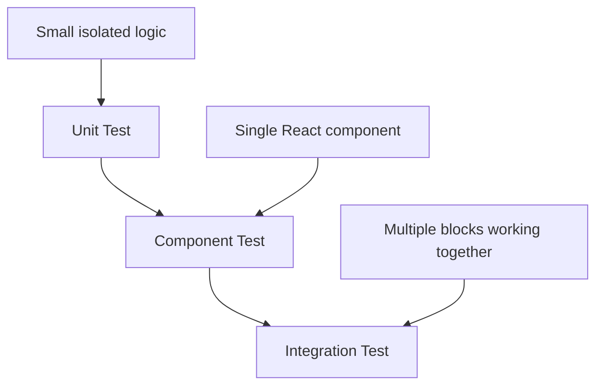
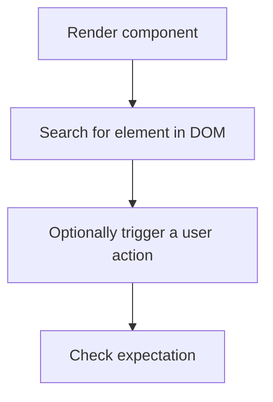
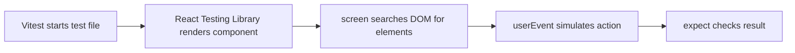

###### Topics

Basics of Testing in React

- Difference between Unit, Integration, and Component Tests
- Purpose and Benefits of Testing in React Applications
- Structure of a Test File and Simple Test Structure

Testing Tools

- Introduction to Vitest for React Projects
- Introduction to React Testing Library
- First Test of a Simple React Component

# 🧪 Basics of Testing in React

Tests in React aren’t just an “extra,” but a tool for verifying that your user interface works as you expect. This is especially important in React 19, as applications often consist of many small components that interact with each other. When props, state, effects, events, or asynchronous data flows change, bugs can appear that are easy to miss with just manual clicking.

Testing in React is therefore not just about “does the code run,” but about whether the application behaves correctly from a user’s perspective. The official React documentation expressly recommends user-centric approaches that focus on the real behavior of the app, rather than just checking internal implementation details ([React – Testing Overview](https://react.dev/learn/testing)).


<br><br><br>
## 🔍 Difference between Unit, Integration, and Component Tests

These three types of tests are often mentioned together but check different things. The main difference lies in **how much of the system is being tested at once**.

### 🧩 Unit Tests

A unit test checks a **small, isolated unit** of your program. This is often a function, sometimes a hook, or some clearly separated logic.

For example, if you have a utility function that calculates a discounted price, that's a typical candidate for a unit test. You provide input and check if the expected output is returned. You are not concerned with the DOM, React itself, or interaction with other components.

Unit tests are fast, precise, and ideal for safeguarding pure logic. They are especially helpful when your application has a lot of calculations, validations, or small helper functions.

A simple memory hook:

> Unit Test = “Does this smallest unit work on its own?”


<br><br><br>
### 🧱 Component Tests

A component test checks a **single React component**. Here, you’re mainly concerned with what is rendered and how the component behaves with user interactions.

For example, you might test:

- Is a title displayed?
- Does a button appear?
- Does the text change after a click?
- Does an error message appear when a condition is met?

In the React environment, component tests are often the most important, as React apps are made up of such UI blocks. With tools like the React Testing Library, you test components as a user would experience them: via visible text, roles, labels, and interactions ([React Testing Library – Introduction](https://testing-library.com/docs/react-testing-library/intro/)).

A component test is therefore more focused on the application’s surface than a unit test.

Memory hook:

> Component Test = “Does this React component behave as it should in the browser?”


<br><br><br>
### 🔗 Integration Tests

An integration test checks the **interaction of multiple parts** of the application. You’re not just looking at an isolated function or a single component, but several units working together.

Typical examples:

- A form component works with validation and a submit handler.
- A page loads data and then displays a list.
- A click in a parent component changes something in a child component.
- Routing, context, API mocks, and UI work together.

The important thing with integration tests is not to mock too much. The point is to see if the involved pieces actually work together correctly. The React Testing Library encourages this mindset: not to test internal details, but the behavior that emerges from multiple parts working together ([Guiding Principles – Testing Library](https://testing-library.com/docs/guiding-principles/)).

Memory hook:

> Integration Test = “Do these parts work together correctly?”


<br><br><br>
### 📊 Comparison of Test Types

| Test Type         | What Is Tested?     | Typical Example in React           | Advantage                          |
|-------------------|---------------------|------------------------------------|-------------------------------------|
| Unit Test         | Small isolated logic| Helper function, formatter, validator, custom hook logic | Very fast, very targeted           |
| Component Test    | A React component   | Button, form field, modal, counter | Tests visible UI behavior           |
| Integration Test  | Interaction of parts| Form + validation + submit + API mock | Detects real workflow issues       |

It's important to note: These categories are not always sharply separated in practice. A component test can be close to integration, for example, if the component uses context, routing, or data states. That’s completely normal. What matters isn’t the test’s name, but **what behavior you want to ensure**.


<br><br><br>
### 🗺️ How the Test Types Relate to Each Other



The more you move towards integration, the closer you are to real app usage. At the same time, tests can become more extensive and slower. That’s why a good test strategy usually mixes all three types.


<br><br><br>
## 🎯 Purpose and Benefits of Tests in React Apps

Tests serve multiple purposes at once. Many people first think of “finding errors,” but the real benefit is broader.

### 🛡️ Catch Errors Early

When you change a component, something that worked before may break. Tests show you these problems early on. This is especially valuable in React, where small changes to props, state, or rendering logic can have unexpected side effects.

Example: You change the structure of a button to make it look prettier. Suddenly, the accessible name is missing, or clicking no longer works. A good test catches this right away.


<br><br><br>
### 🔁 Make Refactoring Safer

React code is constantly being refactored: components are split up, logic moves to hooks, props are renamed, states are reorganized. Tests give you confidence during this process.

When a test checks the visible behavior, not the internal details, you can refactor the internal code fairly freely as long as the component behaves the same for users. That’s one of the biggest practical benefits of tests.


<br><br><br>
### 👀 Ensure Behavior from the User’s Perspective

Modern React tests should imitate real usage as much as possible. Instead of checking whether some internal method was called, it often makes more sense to check:

- Does the user see the correct text?
- Can they click the button?
- Does the expected result appear after a click?
- Is a form error message displayed?

The Testing Library describes this principle: test the way the software is actually used ([Guiding Principles – Testing Library](https://testing-library.com/docs/guiding-principles/)).

That’s important because a test might be “green,” but the app could still be broken for the user.


<br><br><br>
### 📚 Tests as Living Documentation

Well-written tests explain how a component is intended to work. When someone new joins a project, they can often understand more quickly from the tests:

- What inputs does a component expect?
- What happens on a click?
- What states are there?
- What is the desired default case?

This turns tests into a form of documentation that is ideally closer to reality than a written wiki, because it is actually executed.


<br><br><br>
### 🚀 Greater Stability in Teams and Releases

In larger React applications, several developers often work on the same components or pages at the same time. Tests help reveal unintended consequences of changes.

Especially with continuous integration—i.e. automatic checks on push or pull request—tests are a safety net. They don’t catch every bug, but they drastically lower the risk.


<br><br><br>
### ⚠️ What Tests Can't Do

Tests are useful but don’t replace everything.

They don’t automatically guarantee:

- good architecture design,
- flawless business logic,
- perfect usability,
- complete visual accuracy.

A test can also be poorly written. For instance, if it is tied too closely to internal details or checks little of actual value. Good React tests therefore focus on **observable behavior**, not implementation details.


<br><br><br>
## 🧾 Structure of a Test File and Simple Test Structure

In React projects with Vitest and React Testing Library, test files generally look very similar. This recognizability is helpful because it makes tests quick to read and write.

### 🗂️ Typical File Names

Common names are:

- `Button.test.tsx`
- `Counter.test.jsx`
- `LoginForm.spec.tsx`

Vitest usually detects test files by extensions like `.test.` or `.spec.`, depending on your configuration. This is part of Vitest’s usual test setup ([Vitest – Getting Started](https://vitest.dev/guide/)).

The test is usually:

- directly next to the component, or
- in a separate `tests` folder.

Both are valid. In React projects, placing it beside the component is often convenient, as test and implementation are close together.


<br><br><br>
### 🧱 Building Blocks of a Test File

A simple test file usually contains:

1. **Imports**
2. **Test group description with `describe()`**
3. **Individual tests with `test()` or `it()`**
4. **Component rendering**
5. **Querying the DOM**
6. **Assertions with `expect()`**

Here’s a very simple structure:

```tsx
import { render, screen } from '@testing-library/react'
import { describe, test, expect } from 'vitest'
import { Hello } from './Hello'

describe('Hello component', () => {
  test('displays the provided name', () => {
    render(<Hello name="Ada" />)

    expect(screen.getByText('Hallo Ada')).toBeInTheDocument()
  })
})
```

Such a file is small but already contains the essentials:

- `render(...)` renders the React component to a test environment.
- `screen.getByText(...)` searches for visible content.
- `expect(...)` formulates the assertion.

DOM matchers like `toBeInTheDocument()` are typically provided by `@testing-library/jest-dom`, which can also be used with Vitest ([jest-dom – Testing Library](https://github.com/testing-library/jest-dom)).


<br><br><br>
### 🔍 Meaning of the Key Parts

#### `describe()`

`describe()` groups related tests. This is helpful to keep your test output organized. For example, you can put all tests for a component inside a shared block.

```tsx
describe('Button', () => {
  // Tests for the button
})
```

#### `test()` or `it()`

Both practically do the same. They define a single test case.

```tsx
test('renders the button text', () => {
  // ...
})
```

or

```tsx
it('renders the button text', () => {
  // ...
})
```

Many teams choose one style and stick with it.

#### `render()`

With `render()` from the React Testing Library, your component is rendered in a simulated DOM environment. This lets you inspect it almost like it appears in the browser ([React Testing Library – API](https://testing-library.com/docs/react-testing-library/api/)).

#### `screen`

`screen` provides search functions to find elements in the rendered DOM. Often used are:

- `getByRole(...)`
- `getByText(...)`
- `getByLabelText(...)`

The Testing Library recommends queries that are close to real usage, such as roles and labels ([About Queries – Testing Library](https://testing-library.com/docs/queries/about/)).

#### `expect()`

With `expect()`, you define what you expect. For example:

- that an element exists,
- that text is visible,
- that a button is disabled,
- that something appears after a click.


<br><br><br>
### 🧠 Why `getByRole()` is Often Better than `getByText()`

Especially in React tests, `getByRole()` is important because it checks semantically and user-centrically. A button isn’t just detected as text, but as a control element with a role.

Example:

```tsx
screen.getByRole('button', { name: /save/i })
```

This test checks whether a button with the label “Save” exists. This is usually more robust than just searching for text because it also touches on the component’s accessibility ([About Queries – Testing Library](https://testing-library.com/docs/queries/about/)).

For React 19, this is particularly fitting, as modern React apps should have good, accessible UI components.


<br><br><br>
### 🪜 Typical Process for a Simple Component Test



This flow is the foundation of almost all UI tests in React.


<br><br><br>
# 🛠️ Testing Tools

In modern React projects, two tools are most often combined:

- **Vitest** as the test runner
- **React Testing Library** for rendering and testing React components

This combination is very popular today because it is fast, modern, and works well with Vite-based projects. Vitest is tightly integrated into the Vite ecosystem ([Vitest – Why Vitest](https://vitest.dev/guide/why.html)), and the React Testing Library is dedicated to user-centric UI testing ([React Testing Library – Introduction](https://testing-library.com/docs/react-testing-library/intro/)).


<br><br><br>
## ⚡ Introduction to Vitest for React Projects

Vitest is a modern test runner for JavaScript and TypeScript projects. In React projects, Vitest mainly takes care of:

- Finding test files
- Running tests
- Showing results
- Enabling assertions
- Supporting mocks, spies, and setup files

You can think of Vitest as the tool that organizes the entire test process.

### 🧰 Why Vitest is Popular in React Projects

Vitest is especially attractive if your React project uses Vite. Vitest benefits from Vite’s fast infrastructure and module system. This often results in very fast test runs, especially during development ([Vitest – Why Vitest](https://vitest.dev/guide/why.html)).

Further typical benefits:

- fast execution
- good TypeScript support
- modern ESM support
- API familiar to many Jest users

If you have used Jest before, much of Vitest will feel familiar: `describe`, `test`, `expect`, `beforeEach`, `vi.fn()`, and so on.


<br><br><br>
### 🏗️ The Role Vitest Plays in the Test Stack

Vitest doesn’t “by itself” test React components at the user level. For that, you also need the React Testing Library. The roles are roughly:

| Tool                  | Main Task                                       |
|-----------------------|-------------------------------------------------|
| Vitest                | Runs tests, provides structure, enables assertions and mocks |
| React Testing Library | Renders React components, tests UI behavior     |
| jest-dom              | Provides extra DOM matchers like `toBeInTheDocument()` |

That’s how the tools work together.


<br><br><br>
### ⚙️ Typical Basic Setup with Vitest

A typical React project with Vitest will include:

- the `vitest` package
- the `jsdom` package to get browser-like DOM behavior for tests
- a configuration setting the test environment to `jsdom`
- a setup file for `jest-dom`

Example configuration:

```ts
// vitest.config.ts
import { defineConfig } from 'vitest/config'
import react from '@vitejs/plugin-react'

export default defineConfig({
  plugins: [react()],
  test: {
    environment: 'jsdom',
    setupFiles: './src/test/setup.ts',
  },
})
```

Why `jsdom`? React components render HTML-like structures and handle DOM interactions. Node.js doesn’t have a real browser DOM by default. `jsdom` simulates this, making UI tests possible ([Vitest – Environment](https://vitest.dev/guide/environment.html)).

A setup file could look like this:

```ts
// src/test/setup.ts
import '@testing-library/jest-dom/vitest'
```

This makes matchers like `toBeInTheDocument()` available in Vitest ([jest-dom – With Vitest](https://github.com/testing-library/jest-dom#with-vitest)).


<br><br><br>
### 🧪 Key Vitest Functions

#### `describe`, `test`, `expect`

These are the building blocks for your test structure.

```ts
describe('Group', () => {
  test('single test', () => {
    expect(2 + 2).toBe(4)
  })
})
```

#### `beforeEach` and `afterEach`

Let you run code before or after each test. This is helpful when you need to prepare or reset test data.

#### `vi`

`vi` is the mocking and spy tool in Vitest. You can simulate or watch functions.

Example:

```ts
import { vi } from 'vitest'

const onClick = vi.fn()
```

This is especially helpful if you want to check whether an event handler was called.


<br><br><br>
### 👀 Watch Mode and Developer Workflow

Vitest can run tests in watch mode. This means that when you change files, matching tests run automatically again. This is especially nice in React components, as you immediately see if your UI behavior is still correct ([Vitest – CLI](https://vitest.dev/guide/cli.html)).

This makes testing less of a “big extra step” and more a natural part of the development workflow.


<br><br><br>
## 🧪 Introduction to React Testing Library

React Testing Library is a tool for testing React components. It helps you render components, search the DOM, and simulate user interactions.

The central idea: **Test behavior as users experience the interface.** That’s the core principle of the library ([Guiding Principles – Testing Library](https://testing-library.com/docs/guiding-principles/)).

### 🧠 The Basic Principle

Instead of testing internal states or implementation details, you focus on visible effects:

- What’s rendered?
- What does the user see?
- What inputs can the user make?
- What happens after a click?

For React, this makes a lot of sense, as implementations change internally all the time, while the intended visible behavior should stay the same.


<br><br><br>
### 🧱 Core Tools of React Testing Library

#### `render()`

`render()` renders a component in the test environment.

```tsx
render(<Button>Save</Button>)
```

You can then search for the button in the DOM.

#### `screen`

`screen` provides global query functions. This makes tests more readable because you don’t have to deal with values returned by `render()`.

Example:

```tsx
screen.getByRole('button', { name: /save/i })
```

#### Query Types

The main query types are:

| Query         | Meaning                                             |
|---------------|----------------------------------------------------|
| `getBy...`    | Expects the element to be present, throws error otherwise |
| `queryBy...`  | Searches optionally, returns `null` if not found   |
| `findBy...`   | For async cases, waits for the element             |

This is important for React, as UI states often appear asynchronously, for example after loading data, effects, or user actions ([About Queries – Testing Library](https://testing-library.com/docs/queries/about/)).


<br><br><br>
### 🖱️ Testing User Interactions

For interactions, it’s common to use `userEvent`. This lets you simulate more realistic actions than raw DOM events, such as:

- clicking
- typing
- text input
- tab navigation

The Testing Library recommends `@testing-library/user-event` for user-centric interactions ([user-event – Introduction](https://testing-library.com/docs/user-event/intro/)).

Example:

```tsx
import userEvent from '@testing-library/user-event'

const user = userEvent.setup()
await user.click(screen.getByRole('button', { name: /open/i }))
```

This is often closer to actual user behavior than manually firing primitive events.


<br><br><br>
### ♿ Why React Testing Library is Good for Accessibility

Many queries are oriented to semantic HTML roles, labels, and visible names. If you test with `getByRole()` or `getByLabelText()`, you are often automatically writing tests that encourage accessible structures.

Example:

```tsx
screen.getByLabelText(/e-mail/i)
```

If this test fails, it’s a sign that your form field is not labeled correctly. Tests here can indirectly help improve your UI structure.


<br><br><br>
### 🚫 What to Avoid with React Testing Library

It’s less useful to focus on internal details in your tests, such as:

- internal state names,
- specific implementation functions,
- CSS classes as the main evidence for behavior,
- private structure details with no user relevance.

Such tests break easily after refactoring, even though the app itself still works perfectly for users.

This is especially important for React 19: modern React development emphasizes clear components, good accessibility, and user behavior-oriented testing. This fits very well with the philosophy of the Testing Library ([React – Testing Overview](https://react.dev/learn/testing)).


<br><br><br>
## 🧱 First Test of a Simple React Component

Now for the practical part: a first small test of a React component with Vitest and React Testing Library.

### 🧩 Example Component

Here’s a very simple component:

```tsx
// Greeting.tsx
type GreetingProps = {
  name: string
}

export function Greeting({ name }: GreetingProps) {
  return <h1>Hello {name}</h1>
}
```

This component receives a name via props and renders some text.


<br><br><br>
### 🧪 Matching Test File

```tsx
// Greeting.test.tsx
import { render, screen } from '@testing-library/react'
import { describe, test, expect } from 'vitest'
import { Greeting } from './Greeting'

describe('Greeting', () => {
  test('displays the name in the heading', () => {
    render(<Greeting name="Mina" />)

    expect(
      screen.getByRole('heading', { name: 'Hello Mina' })
    ).toBeInTheDocument()
  })
})
```

This test does four things:

1. Renders the component.
2. Searches for a heading.
3. Checks if the heading contains the text “Hello Mina.”
4. Confirms that the element is present in the document.

This is already a good React test because it checks the behavior from the user’s perspective: a user sees a heading with the right content.


<br><br><br>
### 🔍 Step-by-Step Explanation of the Test

#### Import the Tools

```tsx
import { render, screen } from '@testing-library/react'
import { describe, test, expect } from 'vitest'
```

Functions come from both main tools:

- `render` and `screen` from React Testing Library
- `describe`, `test`, and `expect` from Vitest

#### Import the Component to Test

```tsx
import { Greeting } from './Greeting'
```

Ordinary import of the component.

#### Create a Test Group

```tsx
describe('Greeting', () => {
```

This makes it clear: the following tests are for the `Greeting` component.

#### Write an Individual Test

```tsx
test('displays the name in the heading', () => {
```

A good test name describes observable behavior.

#### Render the Component

```tsx
render(<Greeting name="Mina" />)
```

The component is rendered in the test environment with the prop `name="Mina"`.

#### Search for an Element

```tsx
screen.getByRole('heading', { name: 'Hello Mina' })
```

Here we’re not just searching for any text, but a **heading with an accessible name**. That’s semantically correct and robust.

#### Formulate the Expectation

```tsx
expect(...).toBeInTheDocument()
```

Checks if the found element is actually present.


<br><br><br>
### 🖱️ Second Example with Interaction

A simple React component with state illustrates how typical component tests look.

```tsx
// Counter.tsx
import { useState } from 'react'

export function Counter() {
  const [count, setCount] = useState(0)

  return (
    <div>
      <p>Current value: {count}</p>
      <button onClick={() => setCount(count + 1)}>
        Increase
      </button>
    </div>
  )
}
```

Matching test:

```tsx
// Counter.test.tsx
import { render, screen } from '@testing-library/react'
import userEvent from '@testing-library/user-event'
import { describe, test, expect } from 'vitest'
import { Counter } from './Counter'

describe('Counter', () => {
  test('increases the counter after a click', async () => {
    const user = userEvent.setup()

    render(<Counter />)

    expect(screen.getByText('Current value: 0')).toBeInTheDocument()

    await user.click(screen.getByRole('button', { name: /increase/i }))

    expect(screen.getByText('Current value: 1')).toBeInTheDocument()
  })
})
```

This shows the typical UI test flow:

- Check initial state
- Perform a user action
- Check the new state

This is a classic React component test.


<br><br><br>
### 🧠 Why This First Test Is Already “Good”

This test is good because it doesn’t check **how** the state is managed internally, but **what the user sees**. It doesn’t test whether `useState` works internally, or if `setCount` is called with a specific value. Instead, it checks:

- Before clicking, it says `0`
- After clicking, it says `1`

That’s the behavior that matters.

Tests also stay more stable if you refactor internal code later, for instance:

- if you split the component,
- if you move the state logic to a custom hook,
- if you organize the event handler differently.

As long as the visible behavior stays the same, the test can remain valid and unchanged.


<br><br><br>
### 📁 Example of a Sensible Small Project Structure

```text
src/
├─ components/
│  ├─ Greeting.tsx
│  ├─ Greeting.test.tsx
│  ├─ Counter.tsx
│  └─ Counter.test.tsx
├─ test/
│  └─ setup.ts
└─ main.tsx
```

This structure is not strictly required, but it's clear. Test files sit right next to the components, and common test configuration is separated.


<br><br><br>
### 🔄 Interplay of Vitest and React Testing Library in the First Test



You can clearly distinguish the roles of the tools:

- **Vitest** runs the test.
- **React Testing Library** renders and queries the UI.
- **userEvent** simulates user actions.
- **expect** asserts the outcome.


<br><br><br>
### 📌 Key Best Practices for First React Tests

For simple and clear React tests, these points are especially useful:

- Prefer `getByRole()` where possible.
- Write test names describing visible behavior.
- Test the outcome of an interaction, not internal implementation.
- Keep tests small and easy to read.
- Only check what’s relevant for the user or business logic.

A good first test isn’t the one with the most complicated technique, but the one that **safeguards clear, visible behavior reliably**.